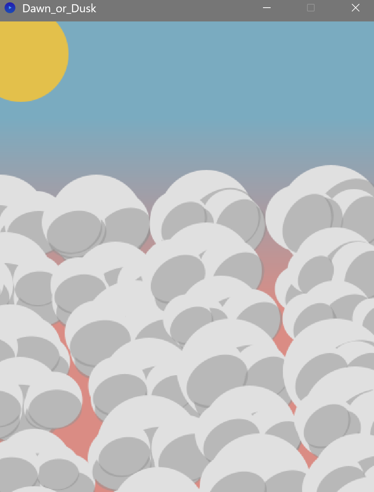
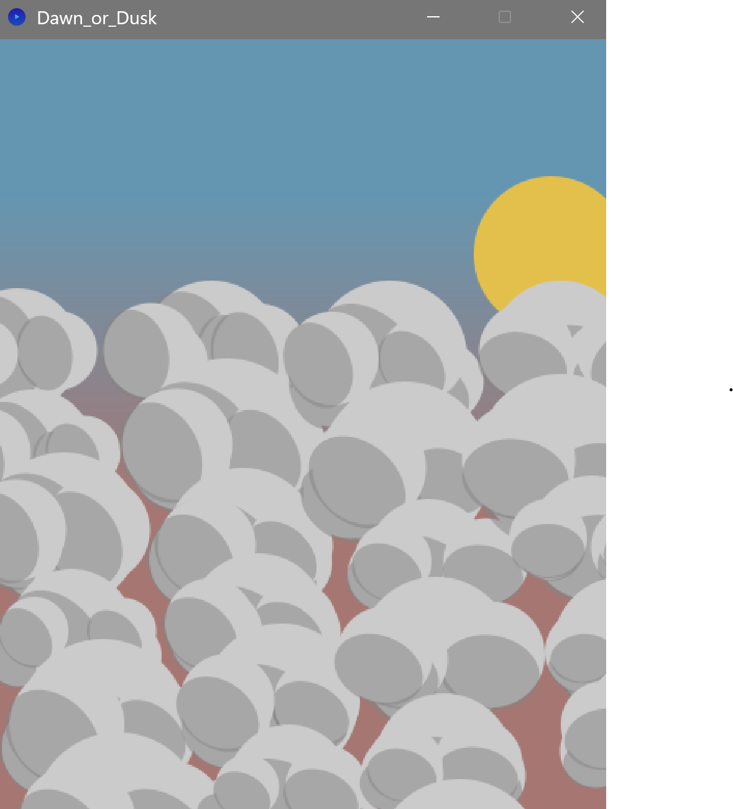
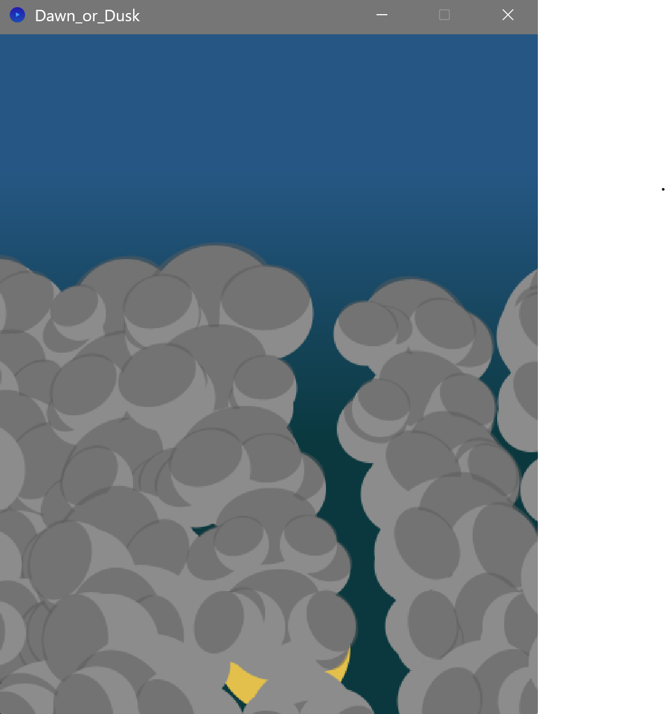

Voici me rendu de mon premier jour d'Esthétique & Algorithmique !

- Le dossier Figure_1 contient une des figures de la présentation.
Les modifications de couleurs que j'ai apportées font que la couleur s'éclaircit au fur et a mesure de temps
et quand le vert est au maximum, on redescend à 0. Le délai fait un effet de cascade.

- Le dossier Dawn_or_Dusk contient ma création personnelle.
Celle-ci consiste à être un simulateur de coucher/lever de soleil.
Cliquer sur la fenêtre permet de déplacer le soleil. 
Chaque clic génère une scene de nuages différent de par sa disposition et les nuages eux mêmes.
Il y a une légère variation lors du placement du nuage mais aussi
Chaque nuage est composé d'un cercle principal et de quatre petits cercles, tous variants en position et taille.

Les ombres des nuages sont logiques par rapport à la position du soleil.
Enfin, plus le soleil est placé bas, plus la nuit s'installe dans notre paysage.

Vous pouvez donc vous amuser à placer le soleil à des endroits différents afin d'avoir une vue qui vous plait
et un paysage unique car les nuages seront différents !

Je me suis inspiré d'un image que j'ai prise qui se trouve dans le dossier Dawn_or_Dusk
Merci au site https://processing.org/reference Pour m'avoir aidé lors de ce projet 
ainsi que des forums en ligne et des camarades d'Imac 1.

