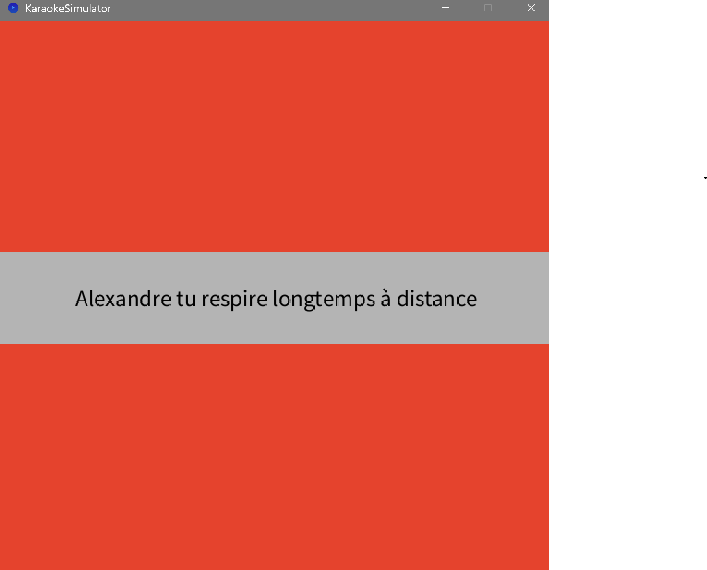

Voici me rendu de mon quatrième jour d'Esthétique & Algorithmique !

- Le dossier KaraokeSimulator contient mon exploration personnelle.
J'ai créé ma propre version du karaoke. Plusieurs structures de phrases sont générées afin d'avoir une chanson générée et chantable en direct.
Les accords sont choisis parmi une liste en fonction de la phrase qui viens d'être générés.
Chaque chanson est donc unique.

Cela s'appuie sur le principe de la Love Letter
https://nickm.com/memslam/love_letters.html

J'utilise la librairie soundcipher qui me permet de jouer des sons midi et des accords qui se trouve dans le dossier librairie.
Pour plus d'information n'hésitez pas à lire la doc ou nous envoyer un mail.
https://explodingart.com/soundcipher/index.html

Merci au site https://processing.org/reference Pour m'avoir aidé lors de ce projet, du site Love Letter, ainsi que des forums en ligne et des camarades d'Imac 1.

