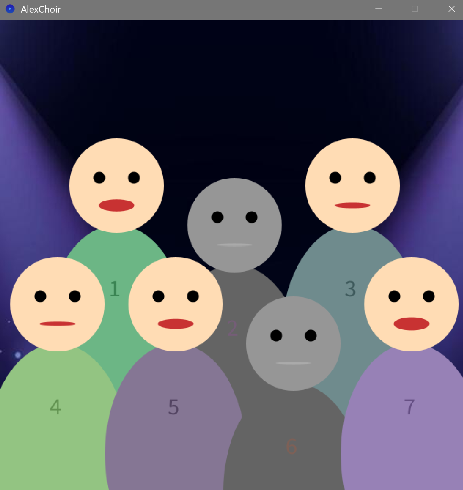

Voici me rendu de mon dernier jour d'Esthétique & Algorithmique !

- Le dossier AlexChoir contient mon projet libre.
J'ai décidé de faire un simulateur de chorale où vous pouvez contrôler des petits personnages en leur cliquant sur la tête ou en appuyant sur leur numéro sur le clavier.
Ces personnages chantent la version acappella de la chanson que j'avais composée lors du workshop d'écriture de Sophie Coiffier.
Le concept viens d'Incredibox? Plus la chorale est pleine plus il y a des voix dedans.
Attention, vous devez jouer le chef d'orchestre, laisser tout le monde chanter tout le temps ne produit pas forcément un beau résultat !
Le nombre de chanteurs est variable, vous pouvez donc vous amuser avec vos fichiers audio (max 7)!

J'utilise ici la librairie Sound développée par Processing qui me permet de jouer des fichier mp3.
Pour l'installer il faut aller dans sketch>Import library>manage libraries puis chercher et installer Sound par Processing.
Pour plus d'information n'hésitez pas à lire la doc ou m'envoyer un mail.
https://processing.org/reference/libraries/sound/index.html

Merci au site https://processing.org/reference Pour m'avoir aidé lors de ce projet, incredibox pour l'inspiration, ainsi que des forums en ligne et des camarades d'Imac 1.

